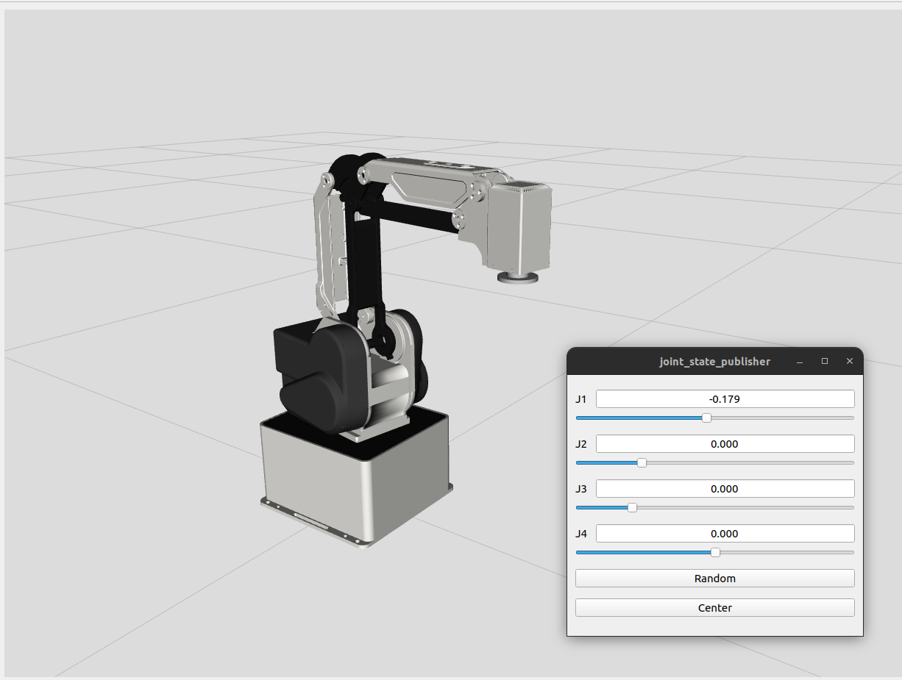

# MG400_RVIZ

Este repositorio alberga los archivos necesarios para la visualización del Dobot MG400 en Rviz2, como parte de un proyecto desarrollado en ROS Humble.



## LAUNCH

```bash
ros2 launch mg400_description display.launch.py
```
